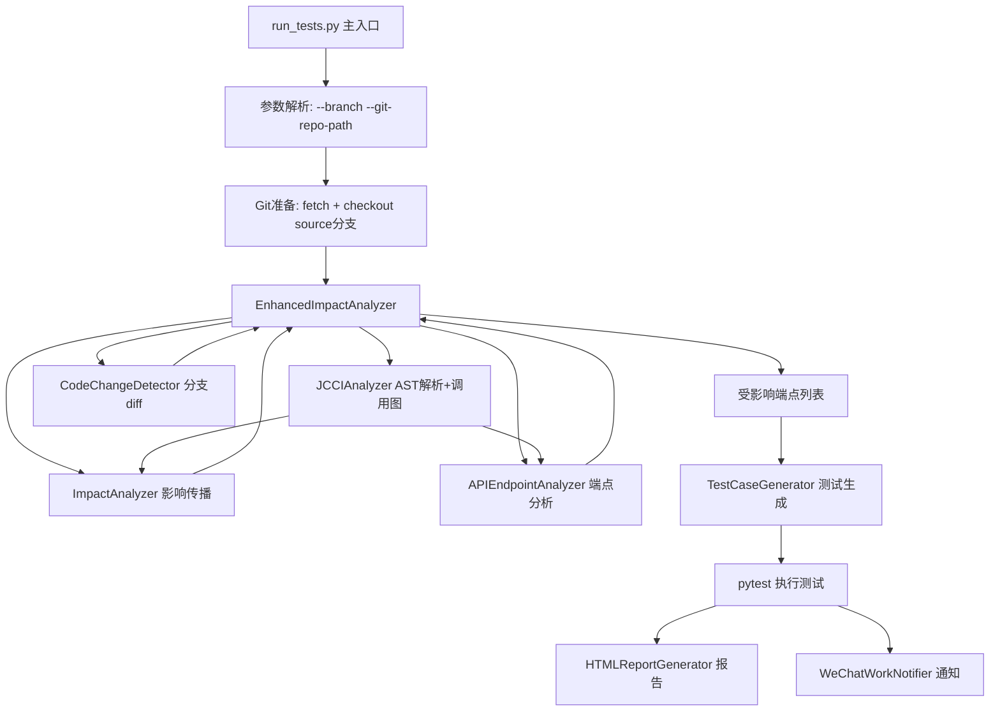

# 设计文档 - 代码精简与核心流程保障

## 整体架构图



## 核心修改设计

### 1. run_tests.py 精简（814行 → ~350行）

**保留核心流程**:
- 参数解析（仅 `--branch`, `--git-repo-path`, `--commit-range`）
- Git 准备（fetch + checkout，直接内联，不依赖 GitManager）
- TestRunner 核心流程（detect → generate → execute → report → notify）
- 失败测试用例重试

**移除/精简**:
- 移除 `--auto-pull`, `--no-auto-pull`, `--force-sync`, `--git-status`, `--environment` 参数
- 移除 GitManager 依赖
- 精简 `_parse_test_results`（使用 pytest --json-report 或简化解析）
- 移除 `_extract_test_data_from_file` 方法
- 移除大量重复的响应数据合并逻辑

**新增关键逻辑**:
- 分支对比前执行 `git fetch --all` + `git checkout source_branch`
- 分析完成后恢复原始分支

### 2. EnhancedImpactAnalyzer 精简

**关键修改**:
- 移除内部重复创建的 CodeChangeDetector（使用外部传入）
- 移除 `_find_all_callers` / `_find_all_callees`（直接使用 ImpactAnalyzer）
- 移除 `_calculate_method_dependency_impact` / `_find_reverse_call_depth`
- 简化 `get_affected_endpoints_for_testing` 逻辑

### 3. CodeChangeDetector 精简

**移除**:
- `_diagnose_branch_issue` 诊断方法
- `_suggest_local_alternatives` 建议方法
- 简化 `_get_changed_files_from_branch_diff` 错误处理

### 4. 移除 git_manager.py

功能合并到 run_tests.py 的简单函数:
```python
def prepare_git_repo(repo_path, source_branch, target_branch):
    """Git仓库准备: fetch + checkout"""
    subprocess.run(['git', 'fetch', '--all'], cwd=repo_path, ...)
    subprocess.run(['git', 'checkout', source_branch], cwd=repo_path, ...)
```

### 5. JCCIAnalyzer 单例共享

确保整个流程只创建一个 JCCIAnalyzer 实例:
```python
jcci = JCCIAnalyzer(project_path)
jcci.initialize()
# 共享给 ImpactAnalyzer 和 APIEndpointAnalyzer
impact = ImpactAnalyzer(project_path, jcci_analyzer=jcci)
endpoint = APIEndpointAnalyzer(project_path, jcci_analyzer=jcci)
```

## 文件变更清单

| 文件 | 操作 | 预估行数变化 |
|------|------|-------------|
| run_tests.py | 重写精简 | 814 → ~350 |
| enhanced_impact_analyzer.py | 精简 | ~500 → ~300 |
| code_change_detector.py | 精简 | ~862 → ~400 |
| git_manager.py | 删除 | -500 |
| jcci_analyzer.py | 微调 | 不变 |
| impact_analyzer.py | 不变 | 不变 |
| api_endpoint_analyzer.py | 不变 | 不变 |
| config/settings.py | 精简 | 164 → ~80 |
| .env | 不变 | 不变 |

## 数据流向图

```
命令行参数 (--branch, --git-repo-path)
    ↓
Git准备 (fetch + checkout source分支)
    ↓
CodeChangeDetector.get_changed_files(branch_range)
    → 返回: 变更的Java文件列表
    ↓
JCCIAnalyzer.initialize()
    → 扫描所有Java文件，构建调用图
    ↓
ImpactAnalyzer.initialize()
    → 从JCCI获取调用图，构建反向依赖
    ↓
APIEndpointAnalyzer.initialize()
    → 从JCCI获取Controller，提取端点
    ↓
EnhancedImpactAnalyzer.get_affected_endpoints_for_testing()
    → 综合分析，返回受影响端点列表
    ↓
TestCaseGenerator.generate_test_cases()
    → 生成pytest测试文件
    ↓
pytest执行 → 结果解析 → HTML报告 + 企微通知
    ↓
Git恢复 (checkout回原分支)
```
