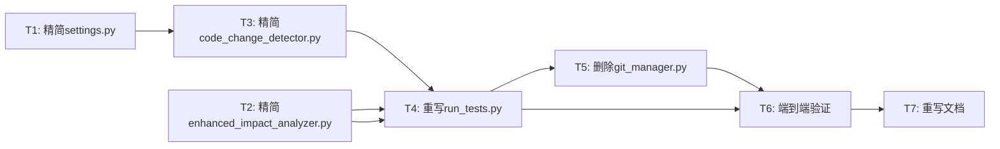

# 任务拆分 - 代码精简与核心流程保障

## 任务依赖图

## 子任务列表

### T1: 精简 config/settings.py
- **输入**: 当前 settings.py（164行）
- **输出**: 精简后 settings.py（~80行）
- **实现约束**: 移除 GitManager 相关配置，保留核心配置
- **验收标准**: 配置加载正常，无导入错误

### T2: 精简 enhanced_impact_analyzer.py
- **输入**: 当前文件（~500行）
- **输出**: 精简后文件（~300行）
- **实现约束**:
  - 移除重复的 `_find_all_callers`/`_find_all_callees`，直接使用 ImpactAnalyzer
  - 移除 `_calculate_method_dependency_impact`/`_find_reverse_call_depth`
  - 简化 `get_affected_endpoints_for_testing`
  - 确保 JCCIAnalyzer 单例共享
- **验收标准**: 核心分析流程正常

### T3: 精简 code_change_detector.py
- **输入**: 当前文件（~862行）
- **输出**: 精简后文件（~400行）
- **实现约束**:
  - 移除 `_diagnose_branch_issue` 和 `_suggest_local_alternatives`
  - 简化 `_get_changed_files_from_branch_diff` 错误处理
  - 移除冗余的 Java 签名解析（JCCIAnalyzer 已有）
- **验收标准**: 分支 diff 检测正常

### T4: 重写 run_tests.py（核心任务）
- **输入**: 当前文件（814行）
- **输出**: 精简后文件（~350行）
- **实现约束**:
  - 仅保留 `--branch`, `--git-repo-path`, `--commit-range` 参数
  - 新增 Git 准备逻辑：fetch + checkout source分支
  - 新增 Git 恢复逻辑：checkout 回原分支
  - 精简测试结果解析
  - 移除 GitManager 依赖
  - 确保 JCCIAnalyzer 单例
- **验收标准**: 命令执行完整流程成功

### T5: 删除 git_manager.py
- **输入**: git_manager.py 文件
- **输出**: 文件删除
- **实现约束**: 确保无其他文件引用
- **验收标准**: 无导入错误

### T6: 端到端验证
- **输入**: 完整精简后的项目
- **输出**: 验证结果
- **实现约束**:
  - 执行 `python run_tests.py --branch origin/test-feature origin/main --git-repo-path "c:\Users\DELL\Desktop\aitest\campus-master"`
  - 验证分支差异检测
  - 验证调用图构建
  - 验证影响分析
  - 验证测试生成
- **验收标准**: 完整流程无错误执行

### T7: 重写 enhanced_impact_analysis.md
- **输入**: 验证通过的项目代码
- **输出**: 更新后的文档
- **实现约束**: 反映精简后的实际代码结构
- **验收标准**: 文档与代码一致
